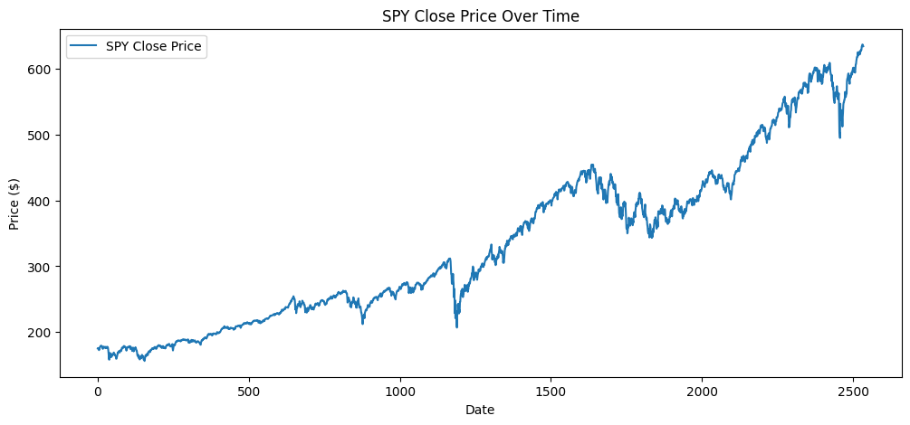
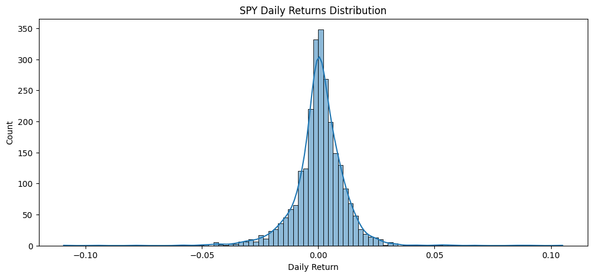
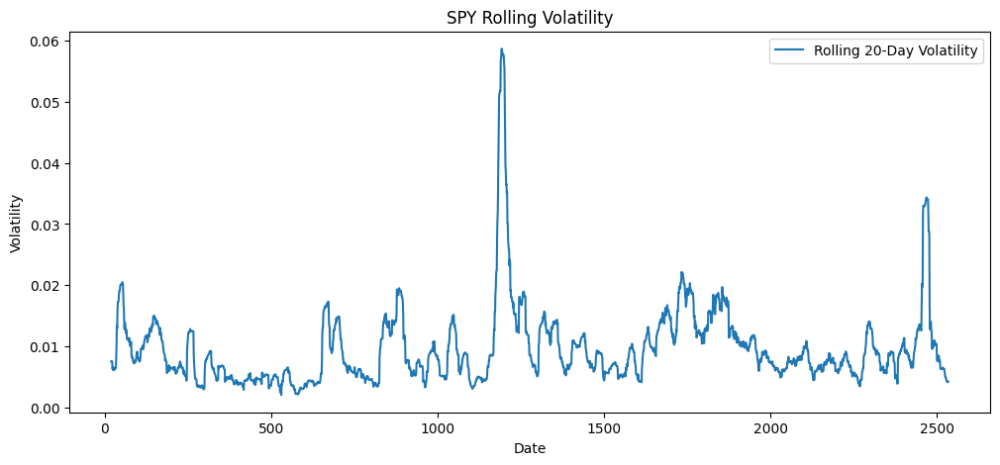
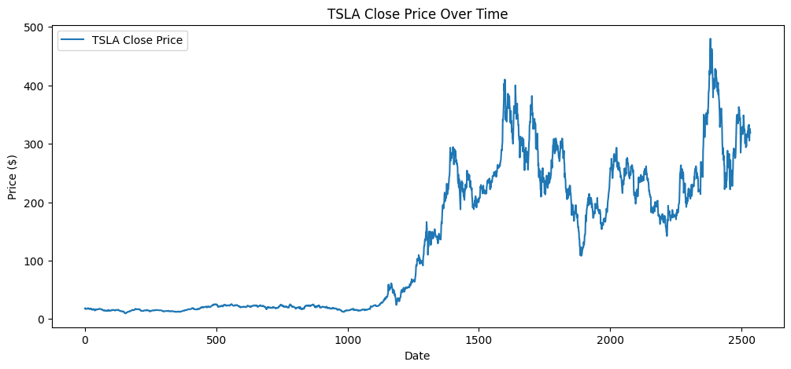
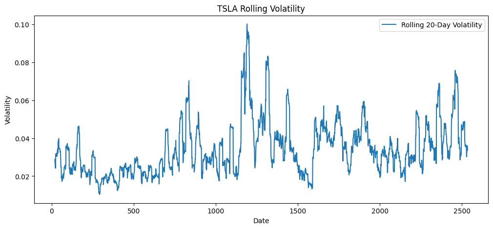

# GMF Investments: Time Series Forecasting & Portfolio Optimization

## Overview
Guide Me in Finance (GMF) Investments is a forward-thinking financial advisory firm specializing in personalized portfolio management. This project applies **time series forecasting**, **risk analysis**, and **Modern Portfolio Theory** to optimize investment portfolios using real-world financial data.

We focus on three key assets:
- **TSLA** – High-growth, high-volatility stock
- **BND** – Stability from U.S. investment-grade bonds
- **SPY** – Broad U.S. market exposure

The project covers data preprocessing, forecasting, optimization, and backtesting.

---

## task-1 summary 

